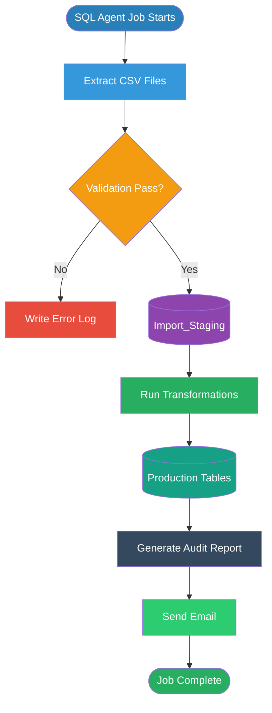

```mermaid
flowchart TD

    Start([SQL Agent Job Starts])

    Start --> Extract[Extract CSV Files]
    Extract --> Validate{Validation Pass?}

    Validate -->|No| Reject[Write Error Log]
    Validate -->|Yes| Stage[(Import_Staging)]

    Stage --> Transform[Run Transformations]
    Transform --> Merge[(Production Tables)]

    Merge --> Report[Generate Audit Report]
    Report --> Notify[Send Email]
    Notify --> End([Job Complete])

    style Start fill:#2980b9,color:white
    style Extract fill:#3498db,color:white
    style Validate fill:#f39c12,color:white
    style Stage fill:#8e44ad,color:white
    style Transform fill:#27ae60,color:white
    style Merge fill:#16a085,color:white
    style Report fill:#34495e,color:white
    style Notify fill:#2ecc71,color:white
    style End fill:#27ae60,color:white
    style Reject fill:#e74c3c,color:white
```