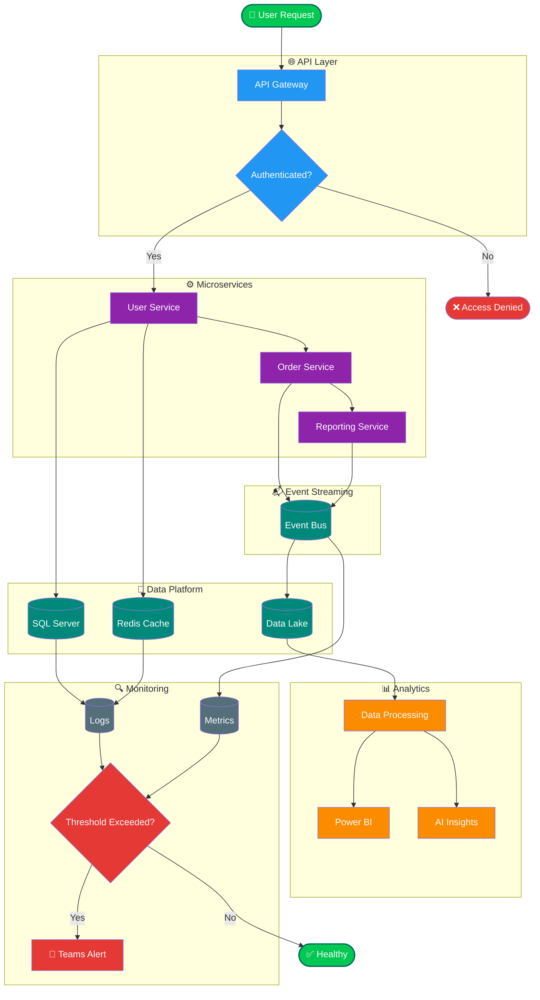

```mermaid
flowchart TB

    Start([🚀 User Request])

    subgraph API["🌐 API Layer"]
        Gateway[API Gateway]
        Auth{Authenticated?}
    end

    subgraph Services["⚙️ Microservices"]
        UserSvc[User Service]
        OrderSvc[Order Service]
        ReportSvc[Reporting Service]
    end

    subgraph Queue["📬 Event Streaming"]
        Kafka[(Event Bus)]
    end

    subgraph Data["💾 Data Platform"]
        SQL[(SQL Server)]
        Redis[(Redis Cache)]
        Lake[(Data Lake)]
    end

    subgraph Analytics["📊 Analytics"]
        ETL[Data Processing]
        BI[Power BI]
        AI[AI Insights]
    end

    subgraph Monitoring["🔍 Monitoring"]
        Logs[(Logs)]
        Metrics[(Metrics)]
        Alert{Threshold Exceeded?}
        Teams[📢 Teams Alert]
    end

    Start --> Gateway
    Gateway --> Auth

    Auth -->|Yes| UserSvc
    Auth -->|No| Denied([❌ Access Denied])

    UserSvc --> Redis
    UserSvc --> SQL

    UserSvc --> OrderSvc
    OrderSvc --> ReportSvc

    OrderSvc --> Kafka
    ReportSvc --> Kafka

    Kafka --> Lake

    Lake --> ETL
    ETL --> BI
    ETL --> AI

    SQL --> Logs
    Redis --> Logs
    Kafka --> Metrics

    Logs --> Alert
    Metrics --> Alert

    Alert -->|Yes| Teams
    Alert -->|No| Healthy([✅ Healthy])

    classDef start fill:#00c853,color:#fff,stroke:#00695c,stroke-width:2px
    classDef api fill:#2196f3,color:#fff
    classDef service fill:#8e24aa,color:#fff
    classDef data fill:#00897b,color:#fff
    classDef analytics fill:#fb8c00,color:#fff
    classDef monitor fill:#546e7a,color:#fff
    classDef alert fill:#e53935,color:#fff

    class Start,Healthy start
    class Gateway,Auth api
    class UserSvc,OrderSvc,ReportSvc service
    class SQL,Redis,Lake,Kafka data
    class ETL,BI,AI analytics
    class Logs,Metrics monitor
    class Alert,Teams,Denied alert
```